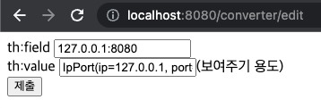
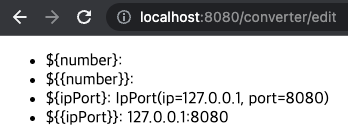
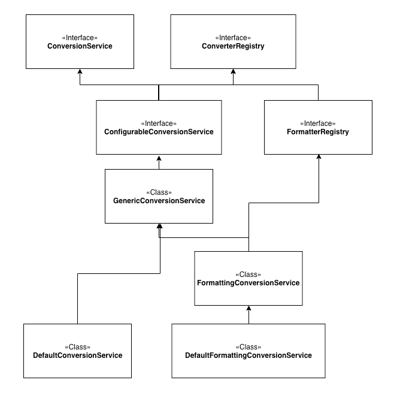
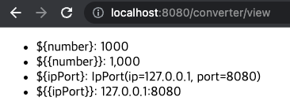
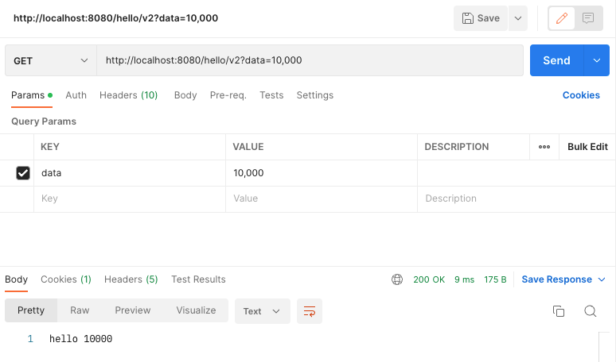
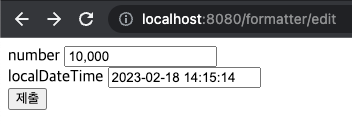
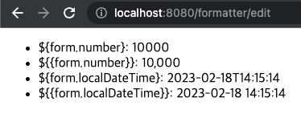

# 스프링 타입 컨버터

## 프로젝트 생성

* 프로젝트 선택
    * Project: Gradle Project
    * Language: Java
    * Spring Boot: 3.0.2
* Project Metadata
    * Group: hello
    * Artifact: spring-core-mvc2-10
    * Name: spring-core-mvc2-10
    * Package name: hello.spring-core-mvc2-10
    * Packaging: Jar
    * Java: 17
    * Dependencies: Spring Web, Lombok, Thymeleaf

## 스프링 타입 컨버터 소개

문자를 숫자로 변환하거나, 반대로 숫자를 문자로 변환해야 하는 것 처럼
애플리케이션을 개발하다 보면 타입을 변환해야 하는 경우가 상당히 많다.

### 예제 1

#### HelloController

```java
@Slf4j
@RestController
public class HelloController {
    @GetMapping("/hello/v1")
    public String helloV1(
            HttpServletRequest req
    ) {
        String data = req.getParameter("data");
        Integer intValue = Integer.valueOf(data);

        log.info("intValue = {}", intValue);
        log.info("typeof data = {}", data.getClass().getSimpleName());
        log.info("typeof intValue = {}", intValue.getClass().getSimpleName());

        return "hello " + data;
    }
}
```

#### 결과

```
intValue = 10
typeof data = String
typeof intValue = Integer
```

### 예제 2

#### HelloController

```java
@Slf4j
@RestController
public class HelloController {
    @GetMapping("/hello/v2")
    public String helloV2(
            @RequestParam Integer data
    ) {
        log.info("data = {}", data);
        log.info("typeof data = {}", data.getClass().getSimpleName());

        return "hello " + data;
    }
}
```

#### 결과

```
data = 10
typeof data = Integer
```

### 설명

앞서 보았듯이 HTTP 쿼리 스트링으로 전달하는 data=10 부분에서 10은 숫자 10이 아니라 문자 10이다.
스프링이 제공하는 `@RequestParam`을 사용하면 이 문자 10을 Integer 타입의 숫자 10으로 편리하게 받을 수 있다.

이것은 스프링이 중간에서 타입을 변환해주었기 때문이다.

이러한 예는 `@ModelAttribute`, `@PathVariable`에서도 확인할 수 있다.

#### 스프링의 타입 변환 적용 예

* 스프링 MVC 요청 파라미터
    * @RequestParam , @ModelAttribute , @PathVariable
* @Value 등으로 YML 정보 읽기
* XML에 넣은 스프링 빈 정보를 변환
* 뷰를 렌더링 할 때

### 스프링과 타입 변환

이렇게 타입을 변환해야 하는 경우는 상당히 많다.
개발자가 직접 하나하나 타입 변환을 해야 한다면, 생각만 해도 괴로울 것이다.
스프링이 중간에 타입 변환기를 사용해서 타입을 String Integer 로 변환해주었기 때문에 개발자는 편리하게 해당 타입을 바로 받을 수 있다.
앞에서는 문자를 숫자로 변경하는 예시를 들었지만, 반대로 숫자를 문자로 변경하는 것도 가능하고, Boolean 타입을 숫자로 변경하는 것도 가능하다.
만약 개발자가 새로운 타입을 만들어서 변환하고 싶으면 어떻게 하면 될까?

### 컨버터 인터페이스

```java
package org.springframework.core.convert.converter;

@FunctionalInterface
public interface Converter<S, T> {
	@Nullable
	T convert(S source);
}
```

스프링은 확장 가능한 컨버터 인터페이스를 제공한다.

개발자는 스프링에 추가적인 타입 변환이 필요하면 이 컨버터 인터페이스를 구현해서 등록하면 된다.
이 컨버터 인터페이스는 모든 타입에 적용할 수 있다.
필요하면 X -> Y 타입으로 변환하는 컨버터 인터페이스를 만들고, 또 Y -> X 타입으로 변환하는 컨버터 인터페이스를 만들어서 등록하면 된다.

예를 들어서 문자로 "true" 가 오면 Boolean 타입으로 받고 싶으면 String -> Boolean 타입으로 변환되도록 컨버터 인터페이스를 만들어서 등록하고,
반대로 적용하고 싶으면 Boolean -> String 타입으로 변환되도록 컨버터를 추가로 만들어서 등록하면 된다.

> **참고**<br>
> 과거에는 `PropertyEditor`라는 것으로 타입을 변환했다.
> `PropertyEditor`는 동시성 문제가 있어서 타입을 변환할 때 마다 객체를 계속 생성해야 하는 단점이 있다.
> 지금은 `Converter`의 등장으로 해당 문제들이 해결되었고, 기능 확장이 필요하면 `Converter`를 사용하면 된다

## 타입 컨버터 - Converter

타입 컨버터를 사용하려면 `org.springframework.core.convert.converter.Converter` 인터페이스를 구현하면 된다.

> **주의**<br>
> `Converter`라는 이름의 인터페이스가 많으니 조심해야 한다.
> `org.springframework.core.convert.converter.Converter`를 사용해야 한다.

### 예제 1

#### StringToIntegerConverter

```java
@Slf4j
public class StringToIntegerConverter implements Converter<String, Integer> {
    @Override
    public Integer convert(String source) {
        log.info("Convert String To Integer source = {}", source);
        return Integer.valueOf(source);
    }
}
```

#### IntegerToStringConverter

```java
@Slf4j
public class IntegerToStringConverter implements Converter<Integer, String> {
    @Override
    public String convert(Integer source) {
        log.info("Convert Integer To String source = {}", source);
        return String.valueOf(source);
    }
}
```

#### ConverterTest

```java
public class ConverterTest {
    @Test
    void stringToInteger() {
        StringToIntegerConverter converter = new StringToIntegerConverter();
        Integer result = converter.convert("10");
        assertThat(result).isEqualTo(10);
    }

    @Test
    void integerToString() {
        IntegerToStringConverter converter = new IntegerToStringConverter();
        String result = converter.convert(10);
        assertThat(result).isEqualTo("10");
    }
}
```

#### 결과

```
Convert String To Integer source = 10
Convert Integer To String source = 10
```

### 예제 2

#### IpPort

```java
@Getter
@EqualsAndHashCode
@RequiredArgsConstructor
public class IpPort {
    private final String ip;
    private final int port;
}
```

#### StringToIpPortConverter

```java
@Slf4j
public class StringToIpPortConverter implements Converter<String, IpPort> {
    @Override
    public IpPort convert(String source) {
        log.info("Convert String To IpPort source = {}", source);

        String[] split = source.split(":");
        return new IpPort(
                split[0],
                Integer.parseInt(split[1])
        );
    }
}
```

#### IpPortToStringConverter

```java
@Slf4j
public class IpPortToStringConverter implements Converter<IpPort, String> {
    @Override
    public String convert(IpPort source) {
        log.info("Convert IpPort To String source = {}", source);
        return source.getIp() + ":" + source.getPort();
    }
}
```

#### ConverterTest

```java
public class ConverterTest {
    @Test
    void stringToIpPort() {
        StringToIpPortConverter converter = new StringToIpPortConverter();
        IpPort result = converter.convert("127.0.0.1:8080");
        assertThat(result).isEqualTo(new IpPort("127.0.0.1", 8080));
    }

    @Test
    void ipPortToString() {
        IpPortToStringConverter converter = new IpPortToStringConverter();
        String result = converter.convert(new IpPort("127.0.0.1", 8080));
        assertThat(result).isEqualTo("127.0.0.1:8080");
    }
}
```

#### 결과

```
Convert String To IpPort source = 127.0.0.1:8080
Convert IpPort To String source = hello.springcoremvc210.type.IpPort@59cb0946
```

### 정리

타입 컨버터 인터페이스가 단순해서 이해하기 어렵지 않을 것이다.
그런데 이렇게 타입 컨버터를 하나하나 직접 사용하면, 개발자가 직접 컨버팅 하는 것과 큰 차이가 없다.
**타입 컨버터를 등록하고 관리하면서 편리하게 변환 기능을 제공하는 역할을 하는 무언가**가 필요하다.

### 참고

> 참고<br>
> 스프링은 용도에 따라 다양한 방식의 타입 컨버터를 제공한다.
>
> * `Converter`: 기본 타입 컨버터
> * `ConverterFactory`: 전체 클래스 계층 구조가 필요할 때
> * `GenericConverter`: 정교한 구현, 대상 필드의 애노테이션 정보 사용 가능
> * `ConditionalGenericConverter`: 특정 조건이 참인 경우에만 실행
>
> 자세한 내용은 공식 문서를 참고하자.
> * https://docs.spring.io/spring-framework/docs/current/reference/html/core.html#coreconvert

> 참고<br>
> 스프링은 문자, 숫자, 불린, Enum 등 일반적인 타입에 대한 대부분의 컨버터를 기본으로 제공한다.
> IDE에서 `Converter`, `ConverterFactory`, `GenericConverter`의 구현체를 찾아보면 수 많은 컨버터를 확인할 수 있다.

## 컨버전 서비스 - ConversionService

이렇게 타입 컨버터를 하나하나 직접 찾아서 타입 변환에 사용하는 것은 매우 불편하다.
그래서 스프링은 개별 컨버터를 모아두고 그것들을 묶어서 편리하게 사용할 수 있는 기능을 제공하는데,
이것이 바로 컨버전 서비스( `ConversionService` )이다.

### ConversionService

```java
package org.springframework.core.convert;

public interface ConversionService {

    // 컨버팅 가능한지 여부
	boolean canConvert(@Nullable Class<?> sourceType, Class<?> targetType);
	boolean canConvert(@Nullable TypeDescriptor sourceType, TypeDescriptor targetType);

    // 컨버팅 기능
	@Nullable
	<T> T convert(@Nullable Object source, Class<T> targetType);

	@Nullable
	Object convert(@Nullable Object source, @Nullable TypeDescriptor sourceType, TypeDescriptor targetType);
}
```

### 예제

#### ConversionServiceTest

```java
public class ConversionServiceTest {

    @Test
    void conversionService() {
        // 등록
        DefaultConversionService conversionService = new DefaultConversionService();
        conversionService.addConverter(new StringToIntegerConverter());
        conversionService.addConverter(new IntegerToStringConverter());
        conversionService.addConverter(new StringToIpPortConverter());
        conversionService.addConverter(new IpPortToStringConverter());

        // 사용
        assertThat(conversionService.convert("10", Integer.class)).isEqualTo(10);
        assertThat(conversionService.convert(10, String.class)).isEqualTo("10");

        IpPort ipPort = conversionService.convert("127.0.0.1:8080", IpPort.class);
        assertThat(ipPort).isEqualTo(new IpPort("127.0.0.1", 8080));

        String ipPortString = conversionService.convert(new IpPort("127.0.0.1", 8080), String.class);
        assertThat(ipPortString).isEqualTo("127.0.0.1:8080");
    }
}
```

#### 결과

```java
[main] INFO hello.springcoremvc210.converter.StringToIntegerConverter - Convert String To Integer source = 10
[main] INFO hello.springcoremvc210.converter.IntegerToStringConverter - Convert Integer To String source = 10
[main] INFO hello.springcoremvc210.converter.StringToIpPortConverter - Convert String To IpPort source = 127.0.0.1:8080
[main] INFO hello.springcoremvc210.converter.IpPortToStringConverter - Convert IpPort To String source = hello.springcoremvc210.type.IpPort@59cb0946
```

### 정리

#### 등록과 사용 분리

컨버터를 등록할 때는 `StringToIntegerConverter`같은 타입 컨버터를 명확하게 알아야 한다.
반면에 컨버터를 사용하는 입장에서는 타입 컨버터를 전혀 몰라도 된다.
타입 컨버터들은 모두 컨버전 서비스 내부에 숨어서 제공된다.
따라서 타입을 변환을 원하는 사용자는 컨버전 서비스 인터페이스에만 의존하면 된다.
물론 컨버전 서비스를 등록하는 부분과 사용하는 부분을 분리하고 의존관계 주입을 사용해야 한다.

#### 컨버전 서비스 사용

```java
Integer value = conversionService.convert("10", Integer.class)
```

### 인터페이스 분리 원칙 - ISP(Interface Segregation Principle)

`DefaultConversionService`는 다음 두 인터페이스를 구현했다.

* `ConversionService`: 컨버터 **사용**에 초점
* `ConverterRegistry`: 컨버터 **등록**에 초점

이렇게 인터페이스를 분리하면 컨버터를 사용하는 클라이언트와 컨버터를 등록하고 관리하는 클라이언트의 관심사를 명확하게 분리할 수 있다.
특히 컨버터를 사용하는 클라이언트는 `ConversionService`만 의존하면 되므로, 컨버터를 어떻게 등록하고 관리하는지는 전혀 몰라도 된다.
결과적으로 컨버터를 사용하는 클라이언트는 꼭 필요한 메서드만 알게된다.
이렇게 인터페이스를 분리하는 것을 ISP 라 한다.

스프링은 내부에서 `ConversionService`를 사용해서 타입을 변환한다.
예를 들어서 앞서 살펴본 `@RequestParam`같은 곳에서 이 기능을 사용해서 타입을 변환한다.

이제 컨버전 서비스를 스프링에 적용해보자.

## 스프링에 Converter 적용하기

### ConverterConfig - 등록하기

```java
@Configuration
public class ConverterConfig implements WebMvcConfigurer {
    @Override
    public void addFormatters(
            FormatterRegistry registry
    ) {
        registry.addConverter(new StringToIpPortConverter());
        registry.addConverter(new IpPortToStringConverter());
        registry.addConverter(new StringToIntegerConverter());
        registry.addConverter(new IntegerToStringConverter());
    }
}
```

스프링은 내부에서 `ConversionService`를 제공한다.
우리는 `WebMvcConfigurer`가 제공하는 `addFormatters()`를 사용해서 추가하고 싶은 컨버터를 등록하면 된다.
이렇게 하면 스프링은 내부에서 사용하는 `ConversionService`에 컨버터를 추가해준다.

### 예제 1 - 기존 코드

#### HelloController

```java
@Slf4j
@RestController
public class HelloController {
    @GetMapping("/hello/v2")
    public String helloV2(
            @RequestParam Integer data
    ) {
        log.info("data = {}", data);
        log.info("typeof data = {}", data.getClass().getSimpleName());

        return "hello " + data;
    }
}
```

#### 결과

```
INFO 4623 --- [nio-8080-exec-3] h.s.converter.StringToIntegerConverter   : Convert String To Integer source = 10
INFO 4623 --- [nio-8080-exec-3] h.s.controller.HelloController           : data = 10
INFO 4623 --- [nio-8080-exec-3] h.s.controller.HelloController           : typeof data = Integer
```

`?data=10`의 쿼리 파라미터는 문자이고 이것을 `Integer data`로 변환하는 과정이 필요하다.
실행해보면 직접 등록한 `StringToIntegerConverter` 가 작동하는 로그를 확인할 수 있다.

그런데 생각해보면 `StringToIntegerConverter`를 등록하기 전에도 이 코드는 잘 수행되었다.
그것은 스프링이 내부에서 수 많은 기본 컨버터들을 제공하기 때문이다.

**컨버터를 추가하면 추가한 컨버터가 기본 컨버터 보다 높은 우선순위를 가진다.**

### 예제 2 - IpPort

#### HelloController

```java
@Slf4j
@RestController
public class HelloController {
    @GetMapping("/ip-port")
    public String ipPort(
            @RequestParam IpPort ipPort
    ) {
        log.info("ipPort = {}", ipPort);
        return ipPort.toString();
    }
}
```

#### 결과

```
INFO 4689 --- [nio-8080-exec-2] h.s.converter.StringToIpPortConverter    : Convert String To IpPort source = 127.0.0.1:8080
INFO 4689 --- [nio-8080-exec-2] h.s.controller.HelloController           : ipPort = IpPort(ip=127.0.0.1, port=8080)
```

`?ipPort=127.0.0.1:8080` 쿼리 스트링이 `@RequestParam IpPort ipPort`에서 객체 타입으로 잘 변환 된 것을 확인할 수 있다.

### 처리과정 정리

`@RequestParam`은 `@RequestParam`을 처리하는 `ArgumentResolver`인
`RequestParamMethodArgumentResolver`에서 `ConversionService`를 사용해서 타입을 변환한다.

부모 클래스와 다양한 외부 클래스를 호출하는 등 복잡한 내부 과정을 거치기 때문에 대략 이렇게 처리되는 것으로 이해해도 충분하다.
만약 더 깊이있게 확인하고 싶으면 `IpPortConverter`에 디버그 브레이크 포인트를 걸어서 확인해보자.

## 뷰 템플릿에 Converter 적용하기

타임리프는 렌더링 시에 컨버터를 적용해서 렌더링 하는 방법을 편리하게 지원한다.
이전까지는 문자를 객체로 변환했다면, 이번에는 그 반대로 객체를 문자로 변환하는 작업을 확인할 수 있다.

### 예제 1 - ${{...}}

#### ConverterController

```java
@Controller
@RequestMapping("/converter")
public class ConverterController {

    @GetMapping("/view")
    public String converterView(
            Model model
    ) {
        model.addAttribute("number", 1000);
        model.addAttribute("ipPort", new IpPort("127.0.0.1", 8080));
        return "converter/view";
    }
}
```

#### converter/view.html

```html
<!DOCTYPE html>
<html xmlns:th="http://www.thymeleaf.org">
<head>
    <meta charset="UTF-8">
    <title>Title</title>
</head>
<body>
<ul>
    <li>${number}: <span th:text="${number}"></span></li>
    <li>${{number}}: <span th:text="${{number}}"></span></li>
    <li>${ipPort}: <span th:text="${ipPort}"></span></li>
    <li>${{ipPort}}: <span th:text="${{ipPort}}"></span></li>
</ul>
</body>
</html>
```

타임리프는 `${{...}}`를 사용하면 자동으로 컨버전 서비스를 사용해서 변환된 결과를 출력해준다.
물론 **스프링과 통합** 되어서 스프링이 제공하는 컨버전 서비스를 사용하므로, 우리가 등록한 컨버터들을 사용할 수 있다.

* 변수 표현식 : `${...}`
* 컨버전 서비스 적용 : `${{...}}`

#### 브라우저


#### Server Log

```
###############
# th:text="${{number}}" 에서 호출
###############
INFO 4834 --- [nio-8080-exec-2] h.s.converter.IntegerToStringConverter   : Convert Integer To String source = 1000

###############
# th:text="${{ipPort}}" 에서 호출
###############
INFO 4834 --- [nio-8080-exec-2] h.s.converter.IpPortToStringConverter    : Convert IpPort To String source = IpPort(ip=127.0.0.1, port=8080)
```

### 정리

* `${{number}}`
    * 뷰 템플릿은 데이터를 문자로 출력한다. (`toString`)
    * 따라서 컨버터를 적용하게 되면 Integer 타입인 10000을 String 타입으로 변환하는 컨버터인 `IntegerToStringConverter`를 실행하게 된다.
    * 이 부분은 컨버터를 실행하지 않아도 타임리프가 숫자를 문자로 자동으로 변환히기 때문에 컨버터를 적용할 때와 하지 않을 때가 같다.
* `${{ipPort}}`
    * 뷰 템플릿은 데이터를 문자로 출력한다. (`toString`)
    * 따라서 컨버터를 적용하게 되면 IpPort 타입을 String 타입으로 변환해야 하므로 `IpPortToStringConverter`가 적용된다.
    * 그 결과 `127.0.0.1:8080`가 출력된다.

### 예제 2 - 폼에 적용하기

#### Form

```java
@Getter
@RequiredArgsConstructor
public class Form {
    private final IpPort ipPort;
}
```

#### ConverterController

```java
@Controller
@RequestMapping("/converter")
public class ConverterController {

    @GetMapping("/edit")
    public String converterForm(
            Model model
    ) {
        IpPort ipPort = new IpPort("127.0.0.1", 8080);
        Form form = new Form(ipPort);

        model.addAttribute("form", form);
        return "converter/form";
    }

    @PostMapping("/edit")
    public String converterEdit(
            @ModelAttribute Form form,
            Model model
    ) {
        IpPort ipPort = form.getIpPort();
        model.addAttribute("ipPort", ipPort);
        return "converter/view";
    }
}
```

#### converter/form.html

```html
<!DOCTYPE html>
<html xmlns:th="http://www.thymeleaf.org">
<head>
    <meta charset="UTF-8">
    <title>Title</title>
</head>
<body>
<form th:method="post" th:object="${form}">
    th:field <input th:field="*{ipPort}" type="text"><br/>
    th:value <input th:value="*{ipPort}" type="text">(보여주기 용도)<br/>
    <input type="submit"/>
</form>
</body>
</html>
```

#### 브라우저 호출 - GET /converter/edit



```
###############
# th:field="*{ipPort}" 에서 호출
###############
INFO 5095 --- [nio-8080-exec-3] h.s.converter.IpPortToStringConverter    : Convert IpPort To String source = IpPort(ip=127.0.0.1, port=8080)
```

#### Submit - POST /converter/edit



```
###############
# @ModelAttribute Form form 에서 호출
###############
INFO 5095 --- [nio-8080-exec-4] h.s.converter.StringToIpPortConverter    : Convert String To IpPort source = 127.0.0.1:8080

###############
# th:text="${{ipPort}}" 에서 호출
###############
INFO 5095 --- [nio-8080-exec-4] h.s.converter.IpPortToStringConverter    : Convert IpPort To String source = IpPort(ip=127.0.0.1, port=8080)
```

### 정리

* `th:field`
    * 타임리프의 `th:field`는 앞서 설명했듯이 `id`, `name`를 출력하는 등 다양한 기능이 있는데, 여기에 컨버전 서비스도 함께 적용된다.

## 포맷터 - Formatter

### 소개

`Converter`는 입력과 출력 타입에 제한이 없는, **범용 타입 변환 기능을 제공**한다.

이번에는 일반적인 웹 애플리케이션 환경을 생각해보자.
불린 타입을 숫자로 바꾸는 것 같은 범용 기능 보다는
개발자 입장에서는 **문자를 다른 타입**으로 변환하거나, **다른 타입을 문자**로 변환하는 상황이 대부분이다.

앞서 살펴본 예제들을 떠올려 보면 문자를 다른 객체로 변환하거나 객체를 문자로 변환하는 일이 대부분이다.

아래 예시처럼 객체를 특정한 포멧에 맞추어 문자로 출력하거나 또는 그 반대의 역할을 하는 것에 **특화된 기능**이 바로 **포맷터(`Formatter`)**이다.
포맷터는 컨버터의 특별한 버전으로 이해하면 된다.

#### 예시

* `Integer` -> `String`
    * 1000 -> "1,000"
    * "1,000" -> 1000
* `Date` -> `String`
    * "2021-01-01 10:50:11"
    * `Locale` 정보가 필요할 수 도 있다.

#### Converter vs Formatter

* `Converter`
    * 범용(객체 -> 객체)
* `Formatter`
    * 문자에 특화(객체 -> 문자, 문자 -> 객체) + 현지화(Locale)
    * `Converter`의 특별한 버전

### Formatter Interface

```java
package org.springframework.format;

@FunctionalInterface
public interface Printer<T> {
	String print(T object, Locale locale);
}

@FunctionalInterface
public interface Parser<T> {
	T parse(String text, Locale locale) throws ParseException;
}

public interface Formatter<T> extends Printer<T>, Parser<T> { }
```

* `String print(T object, Locale locale)`
    * 객체를 문자로 변경한다.
* `T parse(String text, Locale locale)`
    * 문자를 객체로 변경한다.

### 예제

#### MyNumberFormatter

```java
@Slf4j
public class MyNumberFormatter implements Formatter<Number> {
    @Override
    public Number parse(
            String text,
            Locale locale
    ) throws ParseException {
        log.info("MyNumberFormatter.parse call");
        log.info("text = {}, locale = {}", text, locale);

        NumberFormat format = NumberFormat.getInstance(locale);
        return format.parse(text);
    }

    @Override
    public String print(
            Number number,
            Locale locale
    ) {
        log.info("MyNumberFormatter.print call");
        log.info("number = {}, locale = {}", number, locale);

        return NumberFormat.getInstance(locale).format(number);
    }
}
```

#### MyNumberFormatterTest

```java
public class MyNumberFormatterTest {
    MyNumberFormatter formatter = new MyNumberFormatter();

    @Test
    void parse() throws ParseException {
        Number result = formatter.parse("1,000", Locale.KOREA);
        assertThat(result).isEqualTo(1000L);
    }

    @Test
    void print() {
        String result = formatter.print(1000, Locale.KOREA);
        assertThat(result).isEqualTo("1,000");
    }
}
```

#### 결과

```
# parse
INFO hello.springcoremvc210.formatter.MyNumberFormatter - MyNumberFormatter.parse call
INFO hello.springcoremvc210.formatter.MyNumberFormatter - text = 1,000, locale = ko_KR

# print
INFO hello.springcoremvc210.formatter.MyNumberFormatter - MyNumberFormatter.print call
INFO hello.springcoremvc210.formatter.MyNumberFormatter - number = 1000, locale = ko_KR
```

### 정리

> **참고**<br>
> 스프링은 용도에 따라 다양한 방식의 포맷터를 제공한다.
> * `Formatter`: 포맷터
> * `AnnotationFormatterFactory`: 필드의 타입이나 애노테이션 정보를 활용할 수 있는 포맷터
> * 공식 문서: https://docs.spring.io/spring-framework/docs/current/reference/html/core.html#format

## 포맷터를 지원하는 컨버전 서비스

### 소개

컨버전 서비스에는 컨버터만 등록할 수 있고, 포맷터를 등록할 수 는 없다.
그런데 생각해보면 포맷터는 객체 문자, 문자 객체로 변환하는 특별한 컨버터일 뿐이다.

포맷터를 지원하는 컨버전 서비스를 사용하면 컨버전 서비스에 포맷터를 추가할 수 있다.
내부에서 어댑터 패턴을 사용해서 `Formatter`가 `Converter`처럼 동작하도록 지원한다.

`FormattingConversionService`는 포맷터를 지원하는 컨버전 서비스이다.

`DefaultFormattingConversionService`는 `FormattingConversionService`에 기본적인 통화, 숫자 관련 몇가지 기본 포맷터를 추가해서 제공한다.

### FormattingConversionService 원본

```java
package org.springframework.format.support;

public class FormattingConversionService extends GenericConversionService
		implements FormatterRegistry, EmbeddedValueResolverAware {
		
	// ...

    @Override
	public void addPrinter(Printer<?> printer) {
		Class<?> fieldType = getFieldType(printer, Printer.class);
		addConverter(new PrinterConverter(fieldType, printer, this));
	}

	@Override
	public void addParser(Parser<?> parser) {
		Class<?> fieldType = getFieldType(parser, Parser.class);
		addConverter(new ParserConverter(fieldType, parser, this));
	}

	@Override
	public void addFormatter(Formatter<?> formatter) {
		addFormatterForFieldType(getFieldType(formatter), formatter);
	}

	@Override
	public void addFormatterForFieldType(Class<?> fieldType, Formatter<?> formatter) {
		addConverter(new PrinterConverter(fieldType, formatter, this));
		addConverter(new ParserConverter(fieldType, formatter, this));
	}

	@Override
	public void addFormatterForFieldType(Class<?> fieldType, Printer<?> printer, Parser<?> parser) {
		addConverter(new PrinterConverter(fieldType, printer, this));
		addConverter(new ParserConverter(fieldType, parser, this));
	}
	
	// ...
}
```

### 예제

#### FormattingConversionServiceTest

```java
public class FormattingConversionServiceTest {

    @Test
    void formattingConversionService() {
        DefaultFormattingConversionService conversionService = new DefaultFormattingConversionService();

        // 컨버터 등록
        conversionService.addConverter(new StringToIpPortConverter());
        conversionService.addConverter(new IpPortToStringConverter());

        // 포맷터 등록
        conversionService.addFormatter(new MyNumberFormatter());

        // 컨버터 사용
        IpPort ipPort = conversionService.convert("127.0.0.1:8080", IpPort.class);
        assertThat(ipPort).isEqualTo(new IpPort("127.0.0.1", 8080));

        // 포맷터 사용
        String convert = conversionService.convert(1000, String.class);
        assertThat(convert).isEqualTo("1,000");

        Number convert2 = conversionService.convert("1,000", Number.class);
        assertThat(convert2).isEqualTo(1000L);
    }
}
```

#### 결과

```
# conversionService.convert("127.0.0.1:8080", IpPort.class);
INFO hello.springcoremvc210.converter.StringToIpPortConverter - Convert String To IpPort source = 127.0.0.1:8080

# conversionService.convert(1000, String.class);
INFO hello.springcoremvc210.formatter.MyNumberFormatter - MyNumberFormatter.print call
INFO hello.springcoremvc210.formatter.MyNumberFormatter - number = 1000, locale = ko_KR

# conversionService.convert("1,000", Number.class);
INFO hello.springcoremvc210.formatter.MyNumberFormatter - MyNumberFormatter.parse call
INFO hello.springcoremvc210.formatter.MyNumberFormatter - text = 1,000, locale = ko_KR
```

### 정리

#### `DefaultFormattingConversionService` 상속 관계



* `FormattingConversionService`는 `ConversionService` 관련 기능을 상속받기 때문에 결과적으로 컨버터도 포맷터도 모두 등록할 수 있다.
* 그리고 사용할 때는 `ConversionService`가 제공하는 `convert`를 사용하면 된다.
* 추가로 스프링 부트는 `DefaultFormattingConversionService`를 상속 받은 `WebConversionService`를 내부에서 사용한다.

## 포맷터 적용하기

### ConverterConfig

```java
@Configuration
public class ConverterConfig implements WebMvcConfigurer {
    @Override
    public void addFormatters(
            FormatterRegistry registry
    ) {
        /**
         * 주석 처리 이유
         * - 우선순위가 Formatter 보다 Converter 가 높다
         * - Converter > Formatter
         */
        // registry.addConverter(new StringToIpPortConverter());
        // registry.addConverter(new IpPortToStringConverter());

        // Converter 등록
        registry.addConverter(new StringToIpPortConverter());
        registry.addConverter(new IpPortToStringConverter());

        // Formatter 등록
        registry.addFormatter(new MyNumberFormatter());
    }
}
```

### 실행 1 - /converter/view

#### 브라우저 결과

* GET /converter/view



#### Server Log

```
# th:text="${{number}}"
INFO 6147 --- [nio-8080-exec-1] h.s.formatter.MyNumberFormatter          : MyNumberFormatter.print call
INFO 6147 --- [nio-8080-exec-1] h.s.formatter.MyNumberFormatter          : number = 1000, locale = ko

# th:text="${{ipPort}}"
INFO 6147 --- [nio-8080-exec-1] h.s.converter.IpPortToStringConverter    : Convert IpPort To String source = IpPort(ip=127.0.0.1, port=8080)
```

### 실행 2 - /hello/v2?data=10,000

#### Postman



#### Server Log

```
INFO 6147 --- [nio-8080-exec-1] h.s.formatter.MyNumberFormatter          : MyNumberFormatter.parse call
INFO 6147 --- [nio-8080-exec-1] h.s.formatter.MyNumberFormatter          : text = 10,000, locale = ko_KR
INFO 6147 --- [nio-8080-exec-1] h.s.controller.HelloController           : data = 10000
INFO 6147 --- [nio-8080-exec-1] h.s.controller.HelloController           : typeof data = Integer
```

## 스프링이 제공하는 기본 포맷터

### 소개

* 스프링은 자바에서 기본으로 제공하는 타입들에 대해 수 많은 포맷터를 기본으로 제공한다.
* IDE에서 `Formatter`인터페이스의 구현 클래스를 찾아보면 수 많은 **날짜**나 **시간** 관련 포맷터가 제공되는 것을 확인할 수 있다.
* 그런데 포맷터는 기본 형식이 지정되어 있기 때문에, 객체의 각 필드마다 **다른 형식으로 포맷을 지정하기는 어렵다.**
* 스프링은 이런 문제를 해결하기 위해 **애노테이션 기반**으로 원하는 형식을 지정해서 사용할 수 있는 매우 유용한 포맷터 두 가지를 기본으로 제공한다.

* `@NumberFormat`
    * 숫자 관련 형식 지정 포맷터 사용
    * `NumberFormatAnnotationFormatterFactory`
* `@DateTimeFormat`
    * 날짜 관련 형식 지정 포맷터 사용,
    * `Jsr310DateTimeFormatAnnotationFormatterFactory`

### 예제

#### FormatterForm

```java
@Getter
@RequiredArgsConstructor
public class FormatterForm {
    @NumberFormat(pattern = "###,###")
    private final Integer number;

    @DateTimeFormat(pattern = "yyyy-MM-dd HH:mm:ss")
    private final LocalDateTime localDateTime;
}
```

#### FormatterController

```java
@Controller
@RequestMapping("/formatter")
public class FormatterController {

    @GetMapping("/edit")
    public String formatterForm(
            Model model
    ) {
        FormatterForm form = new FormatterForm(10000, LocalDateTime.now());
        model.addAttribute("form", form);

        return "formatter/form";
    }

    @PostMapping("/edit")
    public String formatterEdit(
            @ModelAttribute("form") FormatterForm form
    ) {
        return "formatter/view";
    }
}
```

#### formatter/form.html

```html
<!DOCTYPE html>
<html xmlns:th="http://www.thymeleaf.org">
<head>
    <meta charset="UTF-8">
    <title>Title</title>
</head>
<body>
<form th:method="post" th:object="${form}">
    number <input th:field="*{number}" type="text"><br/>
    localDateTime <input th:field="*{localDateTime}" type="text"><br/>
    <input type="submit"/>
</form>
</body>
</html>
```

#### formatter/view.html

```html
<!DOCTYPE html>
<html xmlns:th="http://www.thymeleaf.org">
<head>
    <meta charset="UTF-8">
    <title>Title</title>
</head>
<body>
<ul>
    <li>${form.number}: <span th:text="${form.number}"></span></li>
    <li>${{form.number}}: <span th:text="${{form.number}}"></span></li>
    <li>${form.localDateTime}: <span th:text="${form.localDateTime}"></span></li>
    <li>${{form.localDateTime}}: <span th:text="${{form.localDateTime}}"></span></li>
</ul>
</body>
</html>
```

### 결과

#### GET /formatter/edit



#### POST /formatter/edit



### 정리

컨버터를 사용하든, 포맷터를 사용하든 등록 방법은 다르지만,
사용할 때는 컨버전 서비스를 통해서 일관성있게 사용할 수 있다.

> **참고**<br>
> `@NumberFormat`, `@DateTimeFormat 의 자세한 사용법이 궁금한 분들은 다음 링크를 참고하거나 관련 애노테이션을 검색해보자.
>
> * https://docs.spring.io/spring-framework/docs/current/reference/html/core.html#format-CustomFormatAnnotations

## 주의 !!!

> 메시지 컨버터(`HttpMessageConverter`)에는 컨버전 서비스가 적용되지 않는다.

특히 객체를 JSON으로 변환할 때 메시지 컨버터를 사용하면서 이 부분을 많이 오해하는데,
`HttpMessageConverter`의 역할은 HTTP 메시지 바디의 내용을 객체로 변환하거나 객체를 HTTP 메시지 바디에 입력하는 것이다.

예를 들어서 JSON을 객체로 변환하는 메시지 컨버터는 내부에서 `Jackson`같은 라이브러리를 사용한다.

객체를 JSON으로 변환한다면 그 결과는 이 라이브러리에 달린 것이다.
따라서 JSON 결과로 만들어지는 숫자나 날짜 포맷을 변경하고 싶으면 해당 라이브러리가 제공하는 설정을 통해서 포맷을 지정해야 한다.
(`Jackson Format` 검색)

결과적으로 이것은 **컨버전 서비스와 전혀 관계가 없다.**
컨버전 서비스는 `@RequestParam`, `@ModelAttribute`, `@PathVariable`, `뷰 템플릿` 등에서 사용할 수 있다.